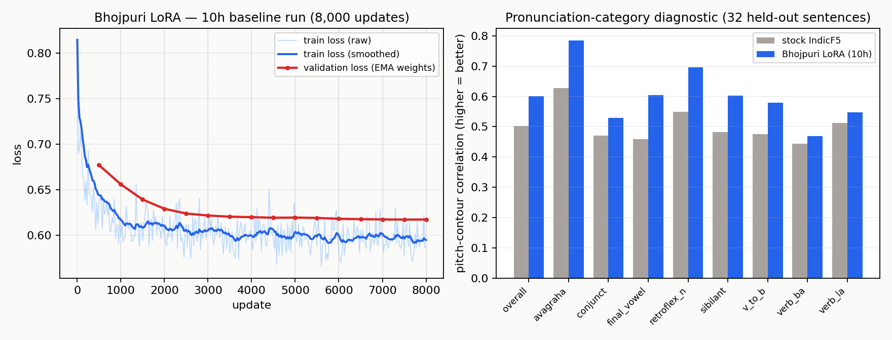

<p align="center">
  
</p>

<h1 align="center">Bhojpuri-F5-TTS</h1>
<p align="center">LoRA fine-tuned (and, eventually, distilled) from <a href="https://huggingface.co/ai4bharat/IndicF5">IndicF5</a> for zero-shot Bhojpuri voice cloning.</p>

<p align="center">
  <a href="https://huggingface.co/gentleman101/bhojpuri-f5-tts"></a>
  <a href="https://huggingface.co/datasets/gentleman101/bhojpuri-syspin-24k"></a>
  
  
</p>

A personal, self-funded learning project: fine-tune [IndicF5](https://huggingface.co/ai4bharat/IndicF5) (F5-TTS architecture, ~330M params) for zero-shot voice cloning in Bhojpuri via LoRA, evaluate honestly against the stock baseline, then (future work) distill to a smaller student model.

## Results so far

The 10-hour baseline LoRA run beats stock IndicF5 on a 32-sentence Bhojpuri-vs-Hindi pronunciation diagnostic set, measuring pitch-contour correlation against real recordings:

| Measure | Stock IndicF5 | This LoRA |
|---|---|---|
| Pitch-contour correlation (↑ better) | 0.502 | **0.601** |
| Pitch RMSE, semitones (↓ better) | 3.759 | **3.207** |
| Spectral (MFCC) distance (↓ better) | 49.355 | **47.079** |



Full numbers, caveats, and the training log: [`docs/PROGRESS_LOG.md`](docs/PROGRESS_LOG.md). Model card and usage: [Hugging Face](https://huggingface.co/gentleman101/bhojpuri-f5-tts).

**Caveats** — these are pitch/spectral proxies, not a pronunciation or intelligibility measure; no native-speaker listening evaluation has been run yet; 32 sentences, one seed. Read `docs/PROGRESS_LOG.md` before trusting this beyond "promising checkpoint."

## Project layout

- `bhojpuri_tts/` — package: model loading, LoRA wiring, data pipeline.
- `scripts/` — training (`train_lora.py`), evaluation (`eval_diagnostics.py`, `compare_eval.py`), monitoring (`dashboard.py`), data prep (`prepare_syspin.py`), infra (`bootstrap.sh`, `pre_pause_check.py`, `run_training.sh`, `push_checkpoints.py`, `pull_run.py`, `pack_data.py`, `restore_data.py`).
- `configs/` — training configs (`lora_slice.yaml`, `lora_10h.yaml`, `smoke_cpu.yaml`).
- `manifests/` — train/val/test splits and the diagnostic sentence set.
- `docs/` — `PROJECT_PLAN.md` (frozen scope + phased plan), `PROGRESS_LOG.md` (timeline, results, incidents), `LEARNING_GUIDE.md`.

## Data & attribution

Trained on the **SYSPIN_S1.0 Bhojpuri corpus**, © Indian Institute of Science (IISc) Bengaluru / SPIRE Lab, CC-BY-4.0. Please cite:

> Abhayjeet et al., "SYSPIN_S1.0 Corpus — A TTS Corpus of 900+ hours in nine Indian Languages", 2025.

## License

Code in this repository is [MIT-licensed](LICENSE). Model weights and data are CC-BY-4.0 (attribution above) — see the [model card](https://huggingface.co/gentleman101/bhojpuri-f5-tts) for the full ethical-use notice regarding the two SYSPIN speaker voices.

## Quickstart

```bash
git clone https://github.com/gentleman101/bhojpuri-f5-tts.git && cd bhojpuri-f5-tts
./scripts/bootstrap.sh                              # health check
python scripts/pull_run.py lora_10h_r32             # fetch the trained checkpoint from HF
./scripts/run_training.sh configs/lora_10h.yaml --resume latest   # or start your own run
```
